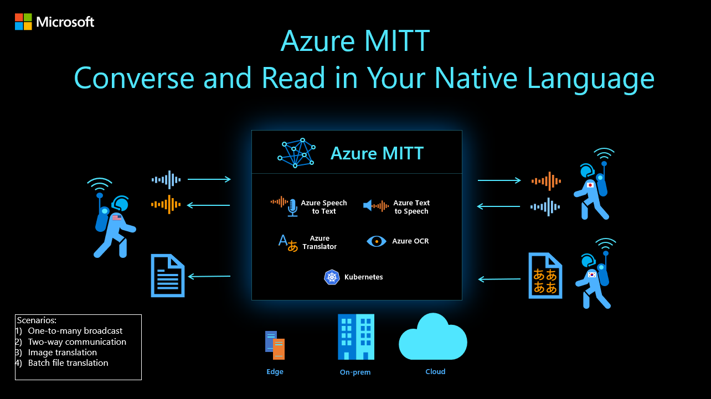

# Azure MITT - Microsoft Machine Interpretation and Translation Toolkit

Utilizing the power of Azure Cognitive Services such as Speech-to-text, Translator, and Neural Text-to-Speech, packaged as containers and orchestrated on Kubernetes, we've created an example of how you can take a world class speech-to-speech translation capabilities anywhere you have the need, on the edge, on premesis, or in the cloud. There are hundreds of supported languages and dialects.

## Features

This project framework provides the following features, including but not limited to:

* Speech-to-Speech translated chat
* Speech-to-Speech translated broadcast in multi-languages
* Batch file transcription and translation
* Image-to-image translation

## Demo

This demo video demonstrates a few of the features. <HERE>

## Resources
 * Azure Cognitive Services https://learn.microsoft.com/en-us/azure/cognitive-services/what-are-cognitive-services
 * Containers https://learn.microsoft.com/en-us/azure/cognitive-services/cognitive-services-container-support

## Next Steps
The source code is pending review before being published.

Contact your Microsoft represetative or the Azure Cognitive Services team to learn more.
